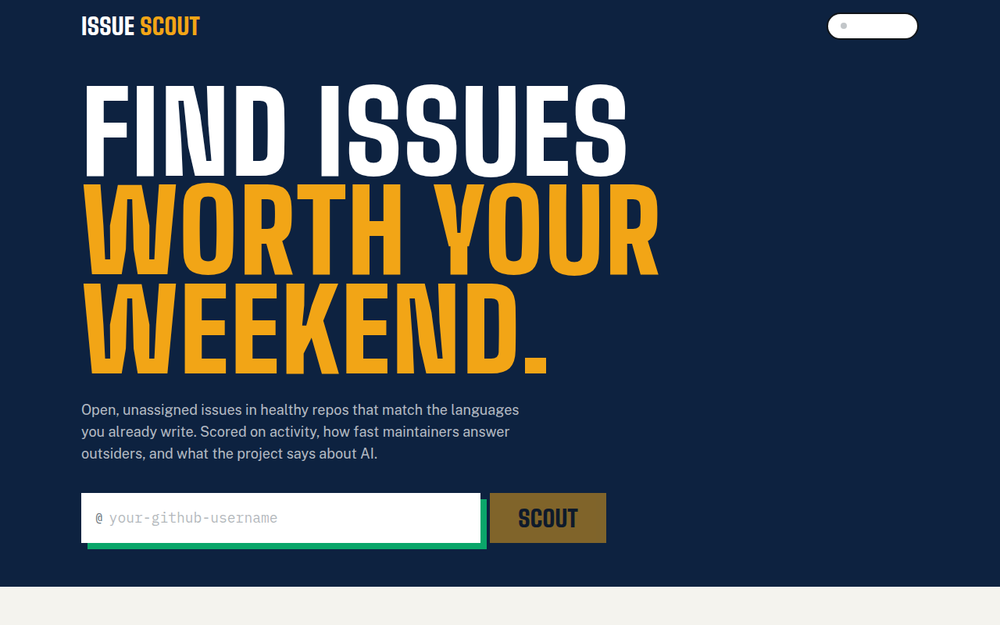
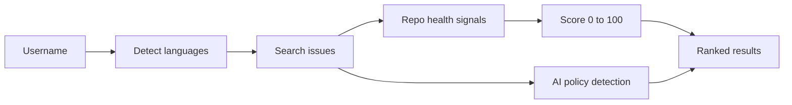

<div align="center">

# issue-scout

**Find open source issues you can actually fix, scored by repo health and contribution policy.**

[](LICENSE)
[](https://nextjs.org)
[](https://www.typescriptlang.org)
[](https://issue-scout-seven.vercel.app)

[Live demo](https://issue-scout-seven.vercel.app) · [Quick start](#quick-start) · [How scoring works](#how-scoring-works) · [Docs](#documentation)



</div>

## Try it

**Live demo:** https://issue-scout-seven.vercel.app

1. Enter a GitHub username and press **Scout**.
2. Filter by AI policy and sort by score or stars.
3. Open an issue on GitHub, or add your own key for an AI plan of attack.

[](https://vercel.com/new/clone?repository-url=https%3A%2F%2Fgithub.com%2Fedgeorgie%2Fissue-scout)

## Key features

- Ranks open, unassigned issues by repository health.
- Flags each project's stance on AI-assisted contributions.
- Filters by AI policy and sorts by score or stars.
- Optional GitHub sign-in for a higher API limit.
- Optional AI plan of attack with your own key (Anthropic or OpenAI).

## How scoring works

Each issue gets a **health score from 0 to 100**, computed from signals of its repository. It is a transparent heuristic, not a model ([ADR 0001](docs/adr/0001-heuristic-score-not-a-model.md)).

| Signal | Points | Full marks when |
|---|---|---|
| Activity | 30 | Last push within 7 days (22 within 30, 12 within 90, 5 within 180, else 0) |
| Response to outsiders | 35 | Median maintainer response to external PRs within 24 hours (28 within 72h, 18 within a week, 8 within 30 days, else 0; 8 if unknown) |
| CONTRIBUTING | 15 | The repo has a CONTRIBUTING file |
| No open PR for the issue | 20 | Nobody already has a pull request open for it |

**Contribution policy** is detected separately by reading the repo's CONTRIBUTING text for AI-assistance rules. Each issue is labeled:

| AI policy | Meaning |
|---|---|
| Forbidden | CONTRIBUTING rejects AI-assisted work |
| Disclosure | CONTRIBUTING asks you to disclose AI assistance |
| Allowed | CONTRIBUTING mentions AI without restricting it |
| Unknown | No AI policy found |



The route detects the user's languages, searches issues, enriches each repository with health signals, scores it and returns ranked results. The client filters and sorts locally. Full diagrams and the module map are in [docs/architecture.md](docs/architecture.md).

## Quick start

Requires Node 22 or newer.

```bash
npm install
npm run dev
```

Open http://localhost:3000.

### Configuration

All variables are optional. Copy `.env.example` to `.env.local` to set them.

| Variable | Purpose |
|---|---|
| `GITHUB_TOKEN` | Raises the GitHub API limit when not using OAuth. Use a fine-grained token without access to private repositories. |
| `GITHUB_CLIENT_ID` | GitHub OAuth App client id. |
| `GITHUB_CLIENT_SECRET` | GitHub OAuth App secret. Callback URL: `<origin>/api/auth/callback`. |

## Keys and privacy

Your model key is bring-your-own (BYOK) and is sent only to the provider you chose, never stored by this app's server.

| Data | Where it goes | Stored |
|---|---|---|
| Username | Sent to this app's route, then to GitHub | Not stored |
| GitHub token (OAuth) | httpOnly cookie | This browser |
| Provider key | Kept for the current tab (`sessionStorage`) by default; sent only to the provider | This tab, or this browser if you tick "Remember on this device" (unencrypted) |
| Issue text for analysis | Sent to the chosen model provider | Not stored |

Use a key with a spending limit. Issue bodies are untrusted input to the model for the optional analysis (indirect prompt injection is possible); the model has no tools and its reply is shown as plain text.

## Limitations

- The in-memory rate limiter resets per server instance.
- A high score measures process health, not project value.
- Unauthenticated GitHub calls are limited to 60 per hour.

## Tech stack

Next.js 16 (App Router), React 19, TypeScript, Tailwind CSS 4, ESLint. Tests run on the Node test runner. No database.

Design: Display Big Shoulders (uppercase), Text Public Sans, Code IBM Plex Mono. Tokens, motion and rationale: [docs/design-system.md](docs/design-system.md).

## Scripts

| Script | Purpose |
|---|---|
| `npm run dev` | Development server |
| `npm run build` | Production build |
| `npm run typecheck` | TypeScript check |
| `npm run lint` | ESLint |
| `npm test` | Unit tests |
| `npm run spec:check` | Traceability gate |
| `npm run verify` | All of the above |

## Documentation

| Document | What it answers |
|---|---|
| [docs/index.md](docs/index.md) | Map of all documentation |
| [docs/architecture.md](docs/architecture.md) | Diagrams and modules |
| [docs/spec/spec.md](docs/spec/spec.md) | Requirements and acceptance criteria |
| [docs/spec/traceability.md](docs/spec/traceability.md) | Requirement to code, test and evidence |
| [docs/design-system.md](docs/design-system.md) | Tokens, motion, components |
| [docs/glossary.md](docs/glossary.md) | Definitions |
| [docs/evaluation.md](docs/evaluation.md) | Self-assessment against a review rubric |
| [docs/adr](docs/adr) | Decision records |

### For AI agents and tools

- [AGENTS.md](AGENTS.md) defines the workflow and quality gates for agents and people.
- [llms.txt](public/llms.txt) is served at `/llms.txt` when deployed and points to the key documents.
- [docs/spec/requirements.json](docs/spec/requirements.json) is the machine-readable requirement list with status, files and tests.
- `npm run verify` is the single deterministic gate: typecheck, lint, traceability check, tests and build.

## Contributing

See [CONTRIBUTING.md](CONTRIBUTING.md). Security reports: [SECURITY.md](SECURITY.md).

## License

[MIT](LICENSE)
