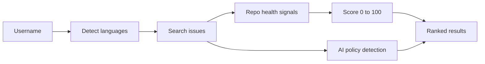

# issue-scout

Find open source issues you can fix, ranked by repository health and contribution policy.

- Ranks open, unassigned issues by repository health
- Flags each project's stance on AI-assisted contributions
- Filters by AI policy and sorts by score or stars
- Optional GitHub sign-in for a higher API limit
- Optional AI plan of attack with your own key

## Try it

[](https://vercel.com/new/clone?repository-url=https%3A%2F%2Fgithub.com%2Fedgeorgie%2Fissue-scout)

```bash
npm install
npm run dev
```

Open http://localhost:3000. Requires Node 22 or newer.

1. Enter a GitHub username and press Scout.
2. Filter by AI policy and sort by score or stars.
3. Open an issue on GitHub, or add a key for a plan of attack.

## Configuration

| Variable | Purpose |
|---|---|
| `GITHUB_TOKEN` | Optional personal token to raise the GitHub API limit when not using OAuth. |
| `GITHUB_CLIENT_ID` | Optional GitHub OAuth App client id. |
| `GITHUB_CLIENT_SECRET` | Optional GitHub OAuth App secret. Callback URL: `<origin>/api/auth/callback`. |

Copy `.env.example` to `.env.local` to set them. All are optional.

## How it works



The route detects the user's languages, searches issues, enriches each repository with health signals, scores it and returns ranked results. The client filters and sorts locally. Full diagrams and the module map are in [docs/architecture.md](docs/architecture.md).

## Key concepts

| Term | Meaning |
|---|---|
| Health score | 0 to 100: activity 30, response to outsiders 35, CONTRIBUTING 15, no open PR for the issue 20. |
| External PR response time | Median time maintainers take to respond to pull requests from outside contributors. |
| AI policy | Whether CONTRIBUTING forbids, requires disclosure of, mentions or ignores AI assistance. |
| Unassigned issue | An open issue nobody has claimed. |
| BYOK | Bring your own key: the user supplies the model key and it never reaches this app's server. |

## Design system

Typography: Display, Big Shoulders, uppercase; Text, Public Sans; Code, IBM Plex Mono.

| Token | Value | Use |
|---|---|---|
| `bg` | `#f4f3ee` | Page background |
| `ink` | `#101418` | Text and hard borders |
| `navy` | `#0d2240` | Header |
| `go` | `#0aa66a` | Strong score, AI welcome |
| `warn` | `#f2a516` | Decent score, disclosure |
| `stop` | `#e5484d` | Risky score, AI not accepted |

- A scoreboard: the number leads, color carries meaning.
- Hard shadows and borders for a tactile, high-contrast look.

Motion, components and rationale: [docs/design-system.md](docs/design-system.md).

## Data flow and privacy

| Data | Where it goes | Stored |
|---|---|---|
| Username | Sent to this app's route, then to GitHub | Not stored |
| GitHub token (OAuth) | httpOnly cookie | This browser |
| Provider key | localStorage, sent only to the provider | This browser |
| Issue text for analysis | Sent to the chosen model provider | Not stored |

## Limits

- The in-memory rate limiter resets per server instance.
- A high score measures process health, not project value.
- Unauthenticated GitHub calls are limited to 60 per hour.

## Documentation

| Document | What it answers |
|---|---|
| [docs/index.md](docs/index.md) | Map of all documentation |
| [docs/architecture.md](docs/architecture.md) | Diagrams and modules |
| [docs/spec/spec.md](docs/spec/spec.md) | Requirements and acceptance criteria |
| [docs/spec/traceability.md](docs/spec/traceability.md) | Requirement to code, test and evidence |
| [docs/design-system.md](docs/design-system.md) | Tokens, motion, components |
| [docs/glossary.md](docs/glossary.md) | Definitions |
| [docs/evaluation.md](docs/evaluation.md) | Self-assessment against a review rubric |
| [docs/adr](docs/adr) | Decision records |

## For AI agents and tools

- [AGENTS.md](AGENTS.md) defines the workflow and quality gates for agents and people.
- [llms.txt](public/llms.txt) is served at `/llms.txt` when deployed and points to the key documents.
- [docs/spec/requirements.json](docs/spec/requirements.json) is the machine-readable requirement list with status, files and tests.
- `npm run verify` is the single deterministic gate: typecheck, lint, traceability check, tests and build.

LLM integration: Issue bodies are untrusted input to the model for the optional analysis (indirect prompt injection is possible). The model has no tools and its reply is shown as plain text.

## Scripts

| Script | Purpose |
|---|---|
| `npm run dev` | Development server |
| `npm run build` | Production build |
| `npm run typecheck` | TypeScript check |
| `npm run lint` | ESLint |
| `npm test` | Unit tests |
| `npm run spec:check` | Traceability gate |
| `npm run verify` | All of the above |

## Contributing

See [CONTRIBUTING.md](CONTRIBUTING.md). Security reports: [SECURITY.md](SECURITY.md).

## License

MIT.
