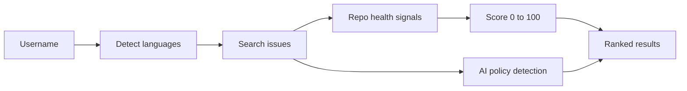
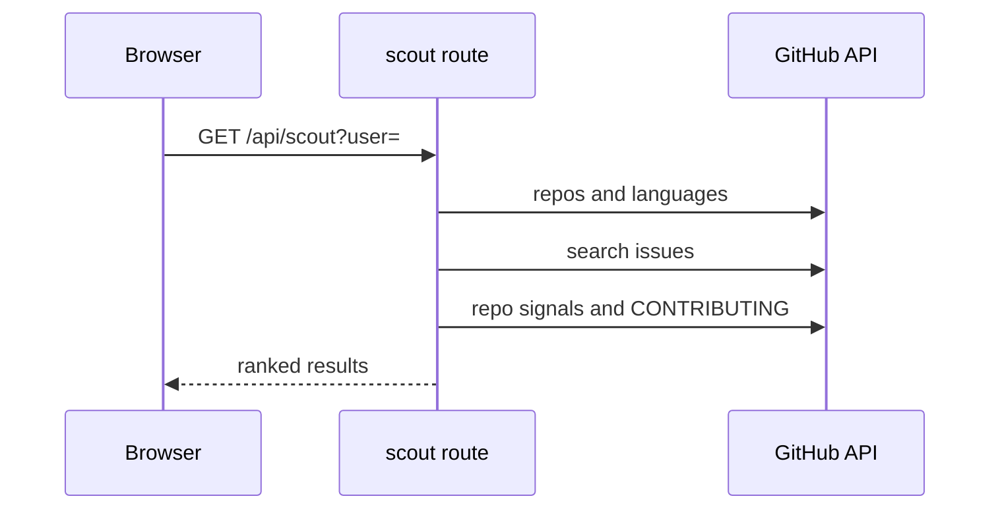

# Architecture

## Data flow

## Main sequence

## Modules

| Path | Responsibility |
|---|---|
| `lib/scout.ts` | Orchestrates language detection and issue search |
| `lib/github.ts` | GitHub API client |
| `lib/scoring.ts` | Score weights |
| `lib/policy.ts` | AI policy classifier |
| `lib/ratelimit.ts` | Per-client limiter |
| `lib/auth.ts` | OAuth helpers |
| `app/api/` | Route handlers |

## Principles

- Pure logic lives in `lib/` and is tested without a browser; components stay thin.
- Network, storage and model replies are validated at the boundary.
- Secrets and user content stay in the browser.

## Decisions

- [Heuristic score, not a model](adr/0001-heuristic-score-not-a-model.md)
